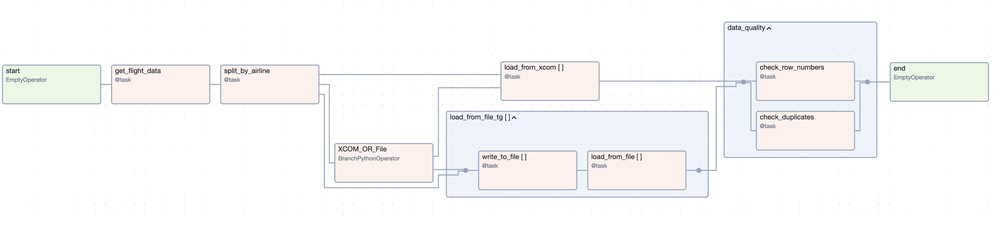

Pour rejoindre notre formation, direction notre plateforme [Ada](https://www.ada-study.com)

# Cours Airflow
Dans ce cours, nous vous proposons d'apprendre l'un des logiciels de source ouverte les
plus utilisés dans le monde de l'ingéniérie des données. En effet, Airflow, un logiciel qui
permet d'orchestrer les _pipelines_ de données a été créé par Airbnb en 2014 et a connu depuis
un succès fulgurant et a été donné à la fondation Apache. Aujourd'hui, il existe trés peu
de rôles pou _data engineer_ ou _analytics engineer_ qui ne demandent pas au moins une 
expérience avec cet outil, malgrés ses nombreux défauts.

## Programme du cours
Pour rendre ce cours le plus pratique possible, on vous propose d'apprendre à utiliser Airflow
en construisant un _pipeline_ de données qui ressemblera à là à ceci



# Mise en place de l'environnement de travail
1. Clonez ou créez un fork de ce repo pour pouvoir travailler dessus directement
2. Installer Docker et Docker compose. Si vous n'êtes pas encore familier avec ces outils,
nous vous proposons de suivre notre cours Docker d'abord. Sachez que vous pourrez 
quand-meême suivre ce cours sans trop de soucis si vous installez Docker en suivant 
les instructions de cette [page](https://docs.docker.com/engine/install/) et Docker compose
en allant sur cette [page](https://docs.docker.com/compose/install/)
3. Assurez-vous enfin que la version de votre installation de Python est au moins 3.8. Voir 
instructions [ici](https://www.wikihow.com/Check-Python-Version-on-PC-or-Mac.) 

Une fois Docker et Docker-compose installés, ouvrez un terminal, naviguez vers le dossier
où ce _repo_ est stocké et lancez éxécutez la commande
```shell
docker compose up airflow-init
```
pour initialiser Airflow. 

Pour lancer Airflow, vous pourrez ensuite utiliser la commande
```shell
docker compose up
```
__Note:__ Il est possible que vous deviez exécuter cette commande 2 fois si la première 
retourne une erreur. 

Pour l'arrêter, la commande suivante suffira
```shell
docker compose down
```

Il vous faudra enfin exécuter la commande:
```shell
pip install requirements.txt
```
qui vous permettra de développer le DAG de ce cours.

# Description du pipeline que l'on va développer
Le pipeline que nous développerons consistera à:
1. Récupérer les données de l'API de [The Open Sky Network](https://opensky-network.org/). 
Ces données sont ces de tous les avions en vol à l'heure actuelle (il y a évidemment une limitation)
2. Organiser les données par compagnie aérienne
3. Charger les données dans DuckDB (pour garder tout ceci en local)
4. Vérifier la qualité des données

Avec ce pipeline, nous toucherons donc:
1. à l'écriture des DAGs
2. aux `task` python
3. aux opérateurs
4. aux `task_group`
5. à la planification des exécutions du DAG
6. aux variables Jinja
7. et beaucoup, beaucoup d'autres concepts même certains peu connus des débutants :)

# Description du jeu de données et création de la table dans DuckDB
## Le jeu de données
On va s'intéresser à l'API en temps réel de [The Open Sky Network](https://opensky-network.org/) qui, si on l'appelle
avec la commande suivante:
```{python}
import requests

url = "https://opensky-network.org/api/states/all?extended=true"

req = requests.get(url)
req.raise_for_status()
data = req.json()
```
nous retourne le `JSON` suivant (exemple):
```{json}
{
    "time": 1726411230,
    "states": [
        ['a21b73', 'N235DW  ', 'United States', 1726413146, 1726413146, -69.0674, 44.4467, 632.46, False, 76.68, 281.61, -0.33, None, 746.76, None, False, 0, 0]
    ]
}
```
où:
  - la clé `time` renvoie au temps Epoch (pour en savoir plus, cliquer [ici](https://fr.wikipedia.org/wiki/Heure_Unix))
  - la clé `states` contient les "vecteurs" (voir [documentation ici](https://openskynetwork.github.io/opensky-api/index.html#state-vectors))

En utilisant la documentation de The Open Sky Network, on peut transformer ces vecteurs
en dictionnaires. Par exemple, le vecteur ci-dessus devient:
```{json}
{
    "icao24": "a21b73",
    "callsign": "N235DW  ",
    "origin_country": "United States",
    "time_position": 1726413146,
    "last_contact": 1726413146,
    "longitude": -69.0674,
    "latitude": 44.4467,
    "baro_altitude": 632.46,
    "on_ground": false,
    "velocity": 76.68,
    "true_track": 281.61,
    "vertical_rate": -0.33,
    "sensors": null,
    "geo_altitude": 746.76,
    "squawk": null,
    "spi": false,
    "position_source": 0,
    "category": 0
}
```

## Création de la base de données DuckDB
Pour créer la base de données DuckDB, je vous recommende de:
  - utiliser [DBeaver](https://dbeaver.io/)
  - Créer la connection vers DuckDB
  - Créer notre table de données brutes avec la commande ci-dessous

```{sql}
CREATE TABLE openskynetwork_brute (
    icao24 STRING,
    callsign STRING,
    origin_country STRING,
    time_position INT,
    last_contact INT,
    longitude FLOAT,
    latitude FLOAT,
    baro_altitude FLOAT,
    on_ground BOOL,
    velocity FLOAT,
    true_track FLOAT,
    vertical_rate FLOAT,
    sensors INT[],
    geo_altitude FLOAT,
    squawk STRING,
    spi BOOL,
    position_source INT,
    category INT
);
```

Pour vérifier que la création de la table est réussie, vous pouvez utiliser le SQL suivant:
```{sql}
SELECT * FROM bdd_airflow.main.openskynetwork_brute 
```
